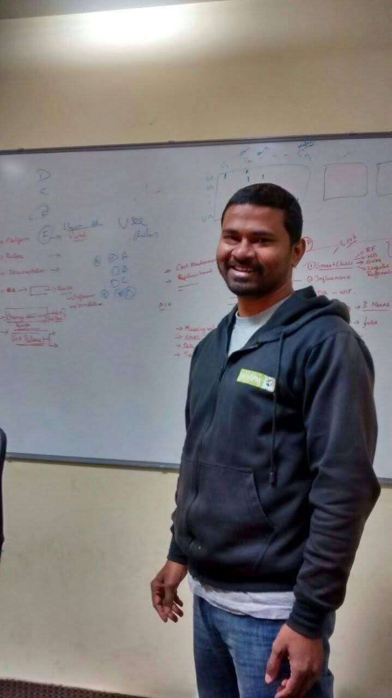

<!--
**bikash119/bikash119** is a ✨ _special_ ✨ repository because its `README.md` (this file) appears on your GitHub profile.

Here are some ideas to get you started:

- 🔭 I’m currently working on ...
- 🌱 I’m currently learning ...
- 👯 I’m looking to collaborate on ...
- 🤔 I’m looking for help with ...
- 💬 Ask me about ...
- 📫 How to reach me: ...
- 😄 Pronouns: ...
- ⚡ Fun fact: ...
-->

  

<h1 align="center">Hi , I'm Bikash Patra </h1>

<h3 align="center">A passionate Engineering Manager in the field of Data and beyond </h3>

<h3 align="center">My Tech Stack</h3>

        </a>     

     
    <a target="_blank" href="https://www.linkedin.com/in/bpatra/"></img></a>
    <a target="_blank" href="https://twitter.com/boredMgrr"></img></a>
     

  

